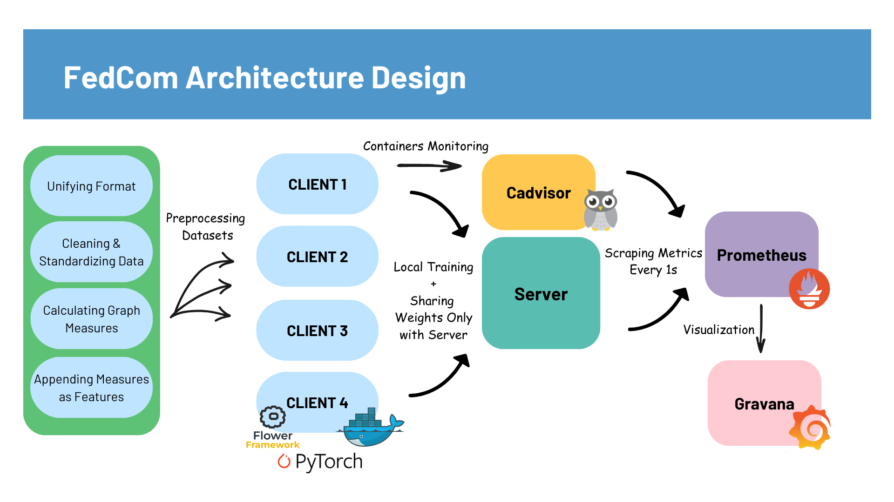
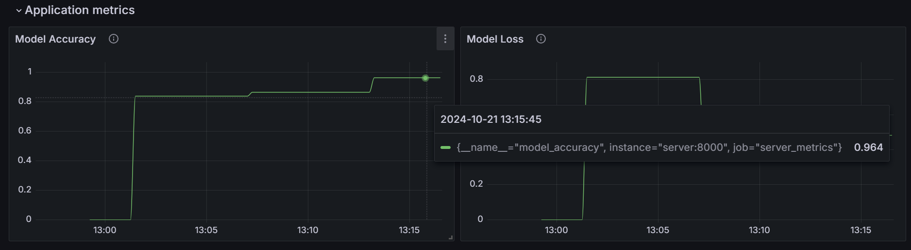

# FedCom: A Federated Learning Project Using Complex Network Measures

## 👨‍💻Introduction
Researches have shown that integrating complex network measures into network detection models improves the accuracy of such models. According to "GDLC", a paper written by Termos et. al(2023) this integration improved detection accuracy in binary classification by up to 7.77%.
These measures offer insights into the connectivity and organization of network components.
They quantify the importance of nodes within the network, and can highlight critical points that might influence overall network behavior. Furthermore, they can enhance model ability to generalize across diverse network configurations.

Federated learning is a machine learning approach where models are trained across multiple decentralized devices or servers that hold local data, without transferring the data to a central server.
It offers several key benefits, including enhanced privacy, reduced computational load, and lower latency. By keeping data on local devices, it protects sensitive information and reduces the risk of data breaches, as no raw data is transmitted to central servers. Additionally, it distributes the computational workload across multiple devices, easing the burden on central systems and allowing more scalable and efficient training. This decentralized approach also reduces latency, as models are updated locally, avoiding the delays associated with transferring large datasets to a central server.

The FedCom project aims to combine complex network measures with federating learning to leverage the benefits of both. It validates the idea in real-world environments where devices have varying data distributions (heterogeneous data) and different computational capacities (heterogeneous devices)

## 🧬Preprocessing Phase
A proprocessing step is performed on the datasets, it involves: <br />
🔵Dropping NaN Values<br />
🔵Dropping Duplicate Values<br />
🔵Choosing Relevant Features<br />
🔵Standardization  <br />
🔵Constructing Network Graph from Dataset<br />
🔵Calculating Complex Network Measures<br />
🔵Appending Complex Network Measures as Features to Dataset <br />
The dataset must be in ./data directory and in csv NF(Netflow) Format.
To preprocess a given dataset run:
```bash
python helpers/dataset_preprocessing.py --name=[NameofYourDataset]
```
The netflow format can be extracted from any pcap file by the nProbe tool:
```bash
nprobe /c --pcap-file-list '[Source pcaps list]' -V 9 -n none -T %OUT_BYTES%OUT_PKTS%L4_DST_PORT%IPV4_DST_ADDR%IPV4_SRC_ADDR %PROTOCOL%L4_SRC_PORT%IN_BYTES%IN_PKTS%L7_PROTO%TCP_FLAGS %FLOW_DURATION_MILLISECONDS --dump-path '[Destination]' --dump-format t --csv-separator , --max-log-lines 100000000 --dont-reforge-timestamps --dump-frequency 100000000
```

## 📊 Handling Data Heterogeneity
To simulate a more realistic federated learning scenario where each client's dataset has distinct properties, we divided the datasets into categories based on graph values calculated during the preprocessing phase. Since online datasets often lack significant variability, we implemented various techniques to modify the datasets. These techniques were designed to introduce different properties to each client’s dataset, reflecting the diversity found in real-world data.
These techniques can be found in <i>modification techniques</i> folder.
The different datasets used in the simulation are:

<table>
  <tr>
    <th style="border: 0.5px solid white;">Dataset 1</th>
    <th style="border: 0.5px solid white;">Dataset 2</th>
    <th style="border: 0.5px solid white;">Dataset 3</th>
    <th style="border: 0.5px solid white;">Dataset 4</th>
  </tr>
  <tr>
    <td style="border: 0.5px solid white;">NF-ToN-IoT</td>
    <td style="border: 0.5px solid white;">NF-UNSW-NB15-Modified</td>
    <td style="border: 0.5px solid white;">NF-BoT-IoT</td>
    <td style="border: 0.5px solid white;">NF-ToN-IoT-Modified
</td>
  </tr>
</table>

## 📲 Handling Device Heterogeneity
Docker is utilized to simulate real-world clients with varying resource constraints. To address device heterogeneity, we implement tailored rules for each container based on its system capabilities. This includes adjusting training parameters like batch sizes and learning rates according to each device's memory capacity and CPU availability. These configurations are defined in the `client_configs` array within the `create_docker_compose script`.

```bash
client_configs = [
      {"mem_limit": "3g", "batch_size": 32, "cpus": 4, "learning_rate": 0.001},
      {"mem_limit": "6g", "batch_size": 256, "cpus": 1, "learning_rate": 0.05},
      {"mem_limit": "4g", "batch_size": 64, "cpus": 3, "learning_rate": 0.02},
      {"mem_limit": "5g", "batch_size": 128, "cpus": 2.5, "learning_rate": 0.09},
]
```
## 🎯 Architecure Design


## 🛠️ Running the Project Simulation
To run the project, you'll need Docker installed and the Docker daemon active on your server. If you haven't installed Docker yet, you can find installation instructions for your specific OS on the Docker website. The only other requirement is that Python must be installed. There's no need to set up a new environment for this example, as all dependencies will be handled within the Docker containers automatically.
You can run the project by thess few steps:

```bash
# Generate docker compose file
python helpers/generate_docker_compose.py --total_clients=4 --num_rounds=5 #You can change no. of rounds or clients

# Build docker images
docker-compose build

# Launch everything
docker-compose up
```
By following the above steps, you will have a fully functional federated learning environment with device/data heterogeneity and monitoring capabilities.

## 🎬 Monitoring Simulation
Several services will automatically launch as defined in `docker-compose.yml` file: </br>
⌚ **Monitoring Services:** </br>
🔹 Prometheus for metrics scraping  </br>
🔹 Cadvisor for container monitoring  </br>
🔹 Grafana for data visualization </br>
🖥️ **Flower Federated Learning Environment:**  </br>
The Flower server and client containers are initialized and start running.</br>

To see the dashboard at your browser: 
Visit `http://localhost:3000` to enter Grafana dashboard:


## Results
With four clients having different datasets and different computing resources, the FedCom Federated Model acheived an accuracy of 96.4% from the third round of server aggregation. The model used was a feed-forward neural network(FNN) with two hidden layers.

This project serves as a foundational example for the combination of complex network measures(to improve accuracy) and federated learning environment(to preserve privacy, reduce latency and load) under real-world circumstances where device & data heterogeneity is present.


